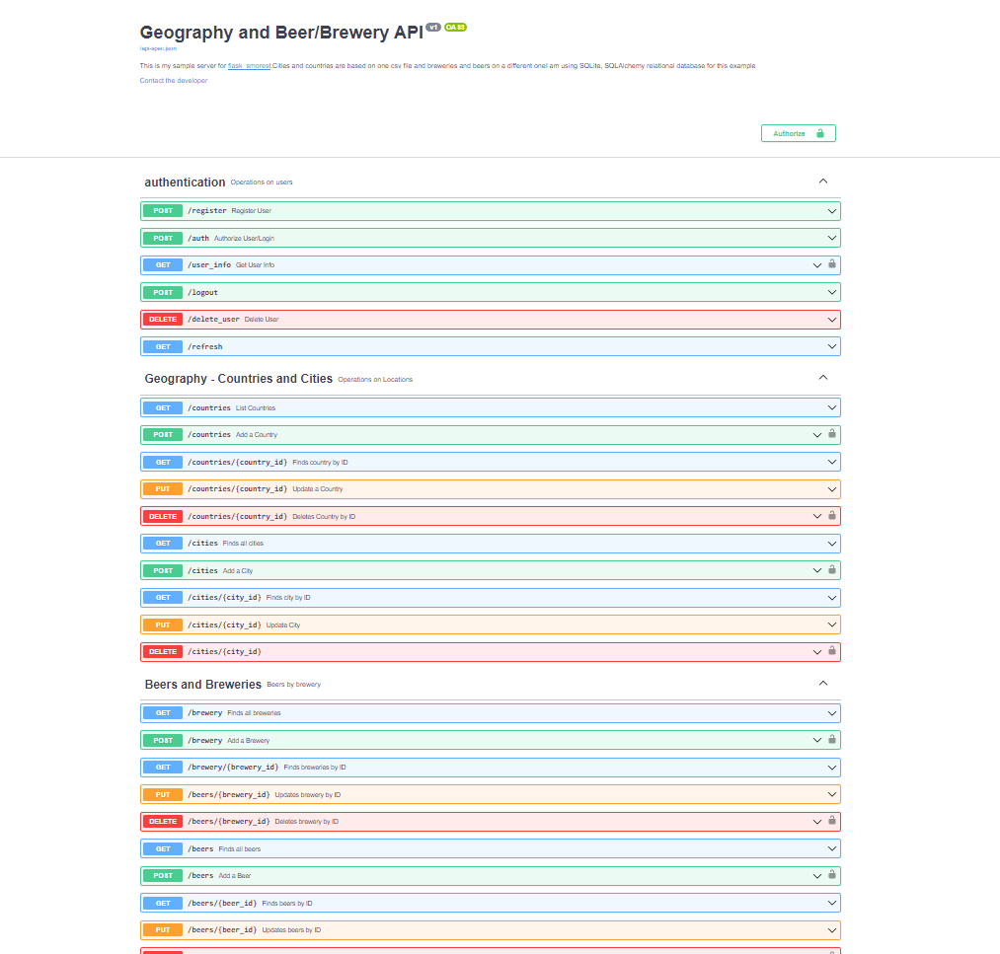

#### Screenshot of my API running on local host 
[Swagger UI Link On Heroku](https://api-project-is960.herokuapp.com/swagger-ui)    <=== click to see swagger UI on heroku

### Resources

1. [Good Example Code I used](https://github.com/picsouds/flask-smorest-example-bookmanager)
2. [smorest - The main libray I used for swagger](https://flask-smorest.readthedocs.io/en/latest/)
3. [CORS Explained](https://medium.com/@baphemot/understanding-cors-18ad6b478e2b)
4. [Marshmallow Explained](https://www.kimsereylam.com/python/2019/10/25/serialization-with-marshmallow.html) 
5. [Help with SQL Alchemy, similar but not exactly how we do it](https://auth0.com/blog/sqlalchemy-orm-tutorial-for-python-developers/)
6. [More or less exactly the queries you need and the code to do it](https://www.golinuxcloud.com/flask-sqlalchemy/)
7. [SQL Alchemy RElationships](https://hackersandslackers.com/sqlalchemy-data-models/)

## Running The app

### Running Locally 

1. Flask Run <- Runs the app
2. Flask routes <- SHows routes
3. pytest --pylint <- run tests and lint

### Running with Docker - Login to the container to run tests

1. docker ps <- lists running containers
2. docker kill <container id>  kills the container, you get the container ID from docker PS
    * Example: docker kill cf373e38ae66
3. docker compose up --build <- builds the app locally
4. docker exec -it <containerID> /bin/bash    <- Logs into the running container
    * Example: docker exec -it cf373e38ae66 /bin/bash
